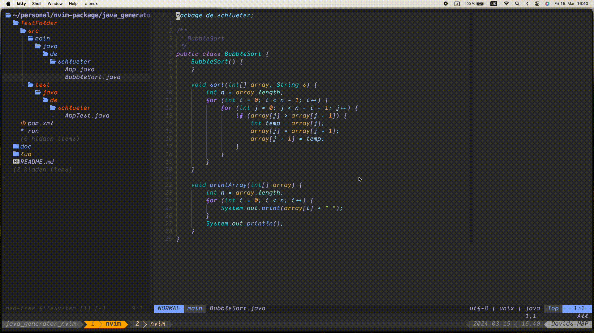

# Java Generation Nvim

> Tool for extracting classes/methodes and generate a Test File for them

# What does this plugin do?

Takes the methodes from your Java class and generate a Test file in the `/test` directory in you **Java** project.

If there is already a plugin present, you just open the buffer of the Test file for **faster** navigation.

## Roadmap
- [x] Create test file with all methodes
- [ ] Create test file with selected methodes only
- [x] Jump to present test file
- [ ] Test for `lua` code

# Contibution

You are welcome to Contribute. I'm a newcommer in writing _NeoVim plugins_ and **Help** is welcome!
Let us make Java work greate in Neovim!

